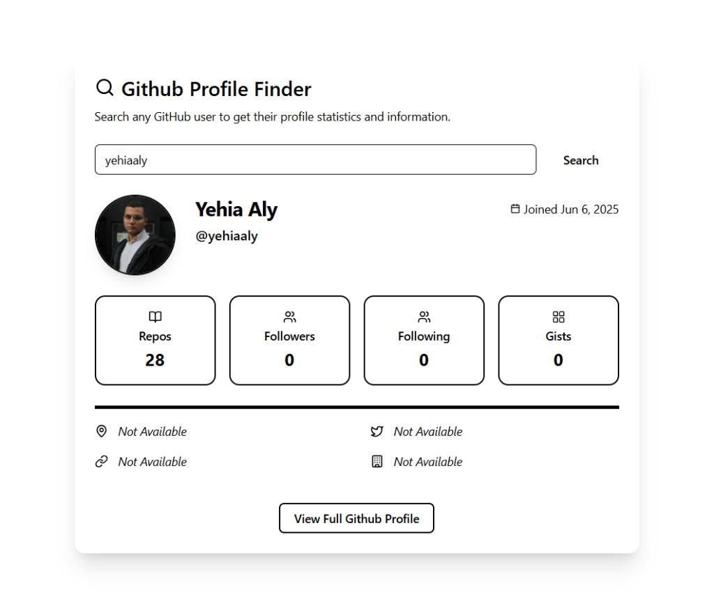

# 🔍 GitHub Profile Finder

A sleek and interactive React application that allows users to search for GitHub profiles and view detailed statistics, repositories, and social links using the GitHub API.



## 🚀 Live Demo

Check out the live demo here: [https://github-profile-stats-search.pages.dev/](https://github-profile-stats-search.pages.dev/)

## ✨ Features

- 🔍 **Real-time Search**: Instant profile fetching using the GitHub REST API.
- 📊 **Comprehensive Stats**: View repositories, followers, following, and gists at a glance.
- 🕒 **Join Date Tracking**: Automatically formats and displays the profile creation date.
- 📱 **Responsive Design**: Fully optimized for mobile, tablet, and desktop views.
- ✨ **Modern UI/UX**: Built with **Tailwind CSS** and **Shadcn UI** for a premium look and feel.
- 🎭 **Smooth Animations**: Integrated entry animations for a dynamic user experience.

## 🛠️ Built With

- **React 19**
- **Vite**
- **TypeScript**
- **Tailwind CSS**
- **Shadcn UI**
- **Lucide React Icons**

## 📦 Getting Started

### 1. Clone the repository

```bash
git clone https://github.com/yehiaaly/github-profile-stats-search.git
```

### 2. Install dependencies

```bash
npm install
```

### 3. Run the development server

```bash
npm run dev
```

## 📖 Documentation

### Usage Example

```tsx
import GithubProfileFinder from "./components/github-profile-finder/GithubProfileFinder";

const App = () => {
  return (
    <div className="flex min-h-screen items-center justify-center bg-gray-50">
      <GithubProfileFinder />
    </div>
  );
};

export default App;
```

### Prop Documentation

The `GithubProfileFinder` component is a standalone feature and does not currently accept external props as it manages its own state for searching and displaying data.

### Project Structure

```text
src/
├── components/
│   ├── github-profile-finder/
│   │   └── GithubProfileFinder.tsx
│   └── ui/                   # Shadcn UI base components
├── types/
│   └── github-user.ts        # TypeScript interfaces
├── App.tsx
├── main.tsx
└── index.css
```

---

Developed with ❤️ by [Yehia Aly](https://github.com/yehiaaly)
